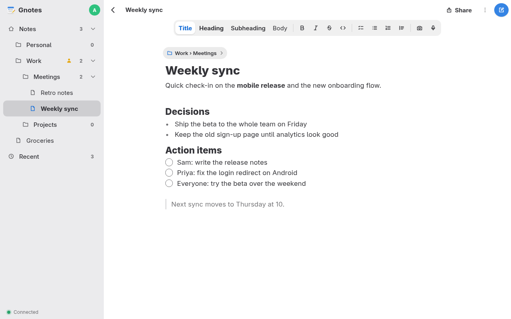
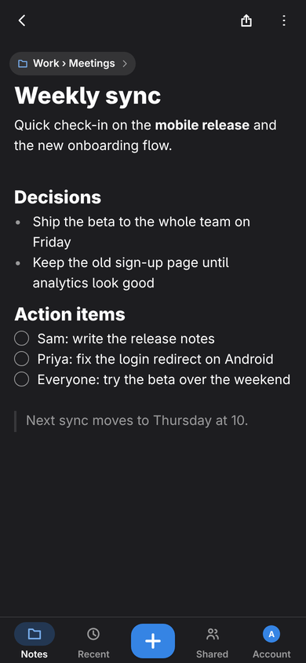

# Gnotes

Self-hosted Markdown notes with live shared editing. Write on your phone or desktop, share a note or a whole notebook with other people on your server, and watch each other type.

<p>
  
  
</p>

- **Markdown that looks finished:** headings, checklists and bold render as you type.
- **Live editing:** several people in one note at once, with cursors.
- **Works offline:** notes you've opened stay on the device, and edits merge when you're back.
- **Notebooks inside notebooks,** drag and drop, full-text search, trash, and import from a zip of Markdown files.
- **Sharing** with other accounts on the server, as editor or viewer. Accounts are made by invite link only.
- **Photos and voice memos** in notes.
- **Optional AI, on your own hardware or a hosted API:** transcribe voice memos (or a meeting, live), pull text out of photos, summarize a note, and find notes by meaning. Nothing runs until an admin sets it up.
- **Plain Markdown copies** of every note in the data folder, so your notes are never locked in.
- **Installable app** (PWA) on phones and desktops, light and dark.
- **Easy to run:** one Docker image, one SQLite database, one data folder.

## Quick start

```sh
docker run -d --name gnotes --restart unless-stopped \
  -p 8080:8080 -v gnotes-data:/data \
  ghcr.io/justinmdickey/gnotes:latest
```

Or build the image from this repo:

```sh
docker build -t gnotes .
docker run -d --name gnotes --restart unless-stopped -p 8080:8080 -v gnotes-data:/data gnotes
```

With Compose, use [`docker-compose.yml`](docker-compose.yml): `docker compose up -d`.

Gnotes now serves on port 8080, with everything stored in the `gnotes-data` volume. For phones and other machines, put it behind HTTPS (see [HTTPS](#https)).

## Create the first admin

```sh
docker exec -it gnotes gnotes-server create-user alice --admin
```

It asks for the password. To script it, pass the password in `GNOTES_PASSWORD` instead:

```sh
docker exec -e GNOTES_PASSWORD='correct horse battery' gnotes gnotes-server create-user alice --admin
```

Add `--display-name "Alice"` to set the name others see. Leave out `--admin` for a regular account.

A server with no accounts also offers to create the first admin on its login page. Whoever gets there first becomes admin, so run `create-user` before the server is reachable from the internet.

## Invite people

There is no open sign-up. An admin makes one-time invite links:

- **Account › People › Invite Someone New** makes a link for a new account.
- A note's or notebook's **Share** button can also invite someone new, and shares it with them once they join.

Links work once and expire after 7 days. Unused ones are listed under **Account › Unused Invites**, where you can cancel them. A link uses the address you opened Gnotes from, so make invites from the public HTTPS address.

## HTTPS

Run Gnotes behind a reverse proxy that handles TLS, and set `GNOTES_PUBLIC_URL` to the address people use. Browsers only allow these over HTTPS (or on `localhost`):

- **Installing the app and working offline:** both need a service worker.
- **Voice memos:** browsers only give a page the microphone over HTTPS.

Over plain HTTP from another machine, Gnotes loads and edits live, but it can't be installed, keeps no offline copy and can't record.

The proxy must pass websocket upgrades through (`/api/ws` and `/api/transcribe/live`). Caddy and Tailscale Serve both do this without extra config.

### Caddy

Caddy gets a certificate for you. With Gnotes on the same host:

```caddyfile
notes.example.com {
	reverse_proxy localhost:8080
}
```

Run Gnotes with `-e GNOTES_PUBLIC_URL=https://notes.example.com`. If only Caddy should reach it, publish the port on localhost only: `-p 127.0.0.1:8080:8080`.

### Tailscale Serve

For devices on your tailnet only, with no public DNS or open ports. Turn on HTTPS certificates in the Tailscale admin console (DNS › HTTPS Certificates), then on the Gnotes host:

```sh
tailscale serve --bg 8080
```

Gnotes is now at `https://<machine>.<tailnet>.ts.net`. Set `GNOTES_PUBLIC_URL` to that address.

### What GNOTES_PUBLIC_URL does

- **Websocket origin check.** Live editing only accepts connections from pages served at this address. When it's unset, the page's origin must match the `Host` header the server sees.
- **Secure cookies.** When it starts with `https://`, the login cookie is marked Secure, so the browser never sends it over plain HTTP.

Once it's set, opening Gnotes at another address (e.g. `http://192.168.1.10:8080`) loads the app, but live editing won't connect. Use the public address.

## Configuration

Settings are environment variables, e.g. `docker run -e GNOTES_PUBLIC_URL=https://notes.example.com`.

| Variable | Default | What it does |
|---|---|---|
| `GNOTES_PUBLIC_URL` | unset | The address people open. See [above](#what-gnotes_public_url-does). |
| `GNOTES_DATA_DIR` | `/data` in Docker, `./data` otherwise | Where the database, attachments and Markdown copies live. |
| `GNOTES_BIND` | `0.0.0.0:8080` | Address and port to listen on. |
| `GNOTES_WEB_DIR` | `/app/web` in Docker, `./web/dist` otherwise | The built web app the server hands out. |
| `GNOTES_WHISPER_URL`, `_MODEL`, `_KEY` | unset; model `whisper-1` | Speech-to-text defaults. See [AI services](#ai-services-optional). |
| `GNOTES_WHISPER_REALTIME_URL` | unset | Live transcription defaults. |
| `GNOTES_VISION_URL`, `_MODEL`, `_KEY` | unset | Text-from-photos defaults. |
| `GNOTES_SUMMARY_URL`, `_MODEL`, `_KEY` | unset | Summary defaults. Ask your notes uses this model too. |
| `GNOTES_EMBED_URL`, `_MODEL`, `_KEY` | unset | Semantic search defaults. |
| `GNOTES_PASSWORD` | unset | Password for `create-user`, instead of the prompt. |
| `RUST_LOG` | `info,loro_internal=warn` | Log level, e.g. `debug`. |

## AI services (optional)

Each one talks to an **OpenAI-compatible API**, so it can be a local server (Ollama, llama.cpp, speaches) or a hosted one (OpenAI, Groq, ...). An admin sets them up under **Account** (Settings), where **Test** checks the connection. The environment variables only set defaults: once saved in the app, the app's settings win. API keys are never sent back to the browser.

| Feature | Settings group | Environment | Example |
|---|---|---|---|
| Transcribe voice memos | Speech-to-Text | `GNOTES_WHISPER_URL`, `_MODEL`, `_KEY` | `http://speaches:8000/v1`, `Systran/faster-whisper-small` |
| Live transcripts and meeting audio | Speech-to-Text › Live URL | `GNOTES_WHISPER_REALTIME_URL` | `ws://speaches:8000/v1/realtime` |
| Text from photos | Text from Photos | `GNOTES_VISION_URL`, `_MODEL`, `_KEY` | `http://ollama:11434/v1`, `qwen2.5vl` |
| Note summaries | AI Summaries | `GNOTES_SUMMARY_URL`, `_MODEL`, `_KEY` | `http://ollama:11434/v1`, `llama3.2` |
| Find notes by meaning | Semantic Search | `GNOTES_EMBED_URL`, `_MODEL`, `_KEY` | `http://ollama:11434/v1`, `nomic-embed-text` |
| Ask your notes | Semantic Search and AI Summaries | both of the above | |

- URLs include the API version (`/v1`).
- The photo model must be able to read images.
- The live URL is a websocket that speaks OpenAI's realtime transcription events. The server connects to it, so it can stay on a private network.
- A summary is only made when someone opens a note's Summary tab.
- Semantic search needs an embedding model. Every note is sent to it in pieces when it's set up, and again a few seconds after each edit. Query instructions that qwen3-embedding, nomic-embed-text, e5 and bge models expect are added by model name.
- Ask is a chat with your notes. Each question sends passages from the eight notes that best match it, by words and by meaning, only from notes the asker can see, to the summary model, along with the last few turns of the conversation. The answer streams in and links the notes it used. Nothing of the conversation is kept on the server.

Turning a service on sends notes, photos or recordings to it, so pick one you trust with them.

## Backups

Everything is in the data folder:

- `gnotes.db`: accounts, notebooks, sharing and note contents (SQLite).
- `blobs/`: photos and recordings.
- `export/`: plain Markdown copies of the notes.

Back up by copying that folder. SQLite must be copied consistently, so either stop Gnotes while you copy, or snapshot the database live with `sqlite3`.

Stopping is the simplest. With the volume from the quick start:

```sh
docker stop gnotes
docker run --rm -v gnotes-data:/data -v "$PWD":/backup debian:trixie-slim \
  tar czf /backup/gnotes-$(date +%F).tar.gz -C /data .
docker start gnotes
```

To back up while it runs, use `sqlite3 gnotes.db ".backup /backups/gnotes.db"` and copy `blobs/` and `export/` beside it. That needs `sqlite3` on the host and the data folder on a bind mount, e.g. `-v /srv/gnotes:/data` instead of the named volume.

To restore, stop Gnotes, put the files back in the data folder, and start it.

## Upgrading

Back up first, then pull the new image and recreate the container with the same volume and settings:

```sh
docker pull ghcr.io/justinmdickey/gnotes:latest
docker stop gnotes && docker rm gnotes
docker run -d --name gnotes --restart unless-stopped \
  -p 8080:8080 -v gnotes-data:/data \
  ghcr.io/justinmdickey/gnotes:latest
```

With Compose: `docker compose pull && docker compose up -d`.

The server updates its database on start. To upgrade only when you choose, use a version tag such as `:1.0` or `:1.0.0` instead of `:latest`. Installed apps switch to the new version the next time they load.

## Development

You need Rust (see `rust-toolchain.toml`) and Node 22.

```sh
cd web && npm ci && npm run build && cd ..
cargo run -p gnotes-server
```

That serves on http://localhost:8080 with data in `./data`. For running it with hot reload, checks and project rules, see [`AGENTS.md`](AGENTS.md). How it's built and why: [`docs/DESIGN.md`](docs/DESIGN.md).

## Status

Used daily by a few people. There's no end-to-end encryption, so whoever runs the server can read its notes.

## License

MIT. See [`LICENSE`](LICENSE).
